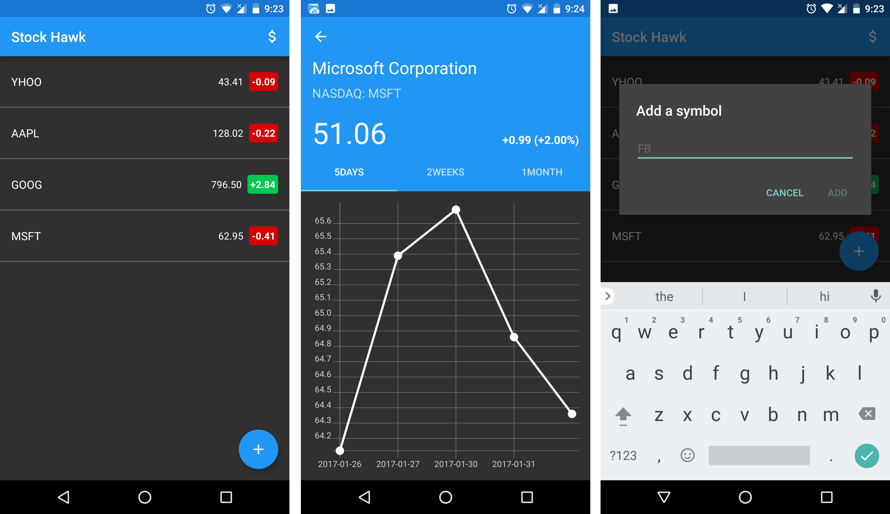

# HackathonApp #
Stock Hawk gives us live stock market status and shows us the rise and fall of price as a graph.Stock Hawk is the fourth project in Udacity's Android Developer Nanodegree. The purpose of this project was to diagnose problems and practice improving apps.

